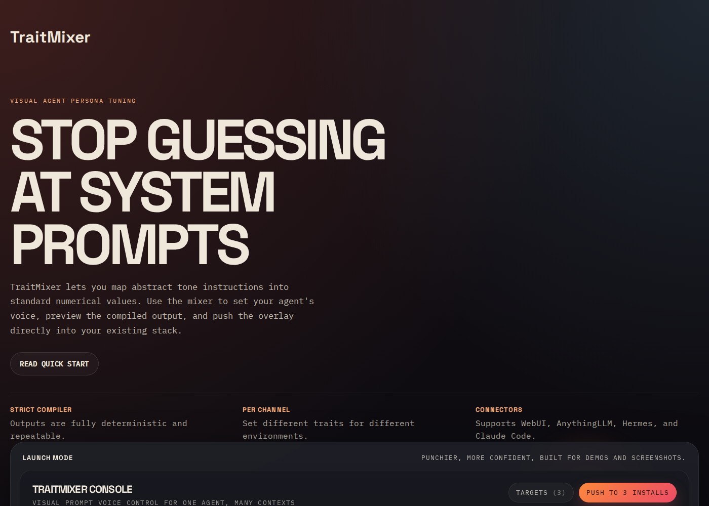

# TraitMixer

TraitMixer is a visual prompt generator for AI agents. It gives you a mixing board interface to control text-response traits (like tone, directness, and humor) and compiles them into a deterministic system prompt overlay.

Use this when your agent works correctly but its written responses are hard to read, overly chatty, generic, or tone-deaf.



## Core Features

- **Deterministic output**: The compiler is strict. The same slider positions always yield the exact same prompt string.
- **Channel overrides**: Define different trait values for specific contexts (like `signal` for fast responses vs `support` for high empathy) without maintaining multiple base prompts.
- **Connectors**: Push compiled overlays directly to Open WebUI, AnythingLLM, Hermes, Agent Zero, OpenClaw, or Claude Code.

## Example

Same prompt:

> I need an excuse to get out of dinner with my friends tonight.

**Without TraitMixer (Default LLM vibe):**

> Here are a few options you can use:
> 1. "I'm feeling a bit under the weather and need to rest."
> 2. "I had something urgent come up at home."

**With TraitMixer (Sarcasm 90%, Directness 100%):**

> "I don't want to go." Alternatively, lie and tell them you have a migraine. It's unprovable and nobody argues with it.

**With TraitMixer (Empathy 100%, Verbosity 80%):**

> It's completely normal to just need a night to yourself sometimes! You could gently tell them, "I was really looking forward to seeing you all, but I'm thoroughly wiped out and need to recharge on the couch." A true friend will absolutely understand that you need to protect your peace.

## Supported targets

| Target | Integration | What TraitMixer changes |
| --- | --- | --- |
| [Open WebUI](https://github.com/open-webui/open-webui) | HTTP API | Updates model system prompt |
| [AnythingLLM](https://github.com/Mintplex-Labs/anything-llm) | HTTP API | Updates workspace prompt |
| [Hermes Agent](https://github.com/NousResearch/hermes-agent) | File write | Injects into `SOUL.md` |
| [Agent Zero](https://github.com/agent0ai/agent-zero) | File write | Injects into `agent.system.md` |
| [OpenClaw](https://github.com/openclaw/openclaw) | File write | Updates workspace `SOUL.md` by default (or another chosen bootstrap file) |
| [Claude Code](https://code.claude.com/docs/en/memory) | File write | Injects into `CLAUDE.md` or `.claude/CLAUDE.md` |

## Quick start

```bash
git clone https://github.com/wspotter/traitmixer.git
cd traitmixer
pnpm install
pnpm dev
```

Then open:

- UI: `http://localhost:4401`
- Push API: `http://localhost:4400`

## Commands

| Command | What it does |
| --- | --- |
| `pnpm dev` | Runs the UI and local push server |
| `pnpm dev:ui` | Runs only the UI |
| `pnpm dev:server` | Runs only the push server |
| `pnpm build` | Builds all workspace packages |
| `pnpm test` | Runs all tests |
| `pnpm test:core` | Runs compiler tests |
| `pnpm test:ui` | Runs UI tests |
| `pnpm typecheck` | Runs TypeScript project checks |
| `pnpm verify` | Runs tests, typecheck, and builds all packages |
| `pnpm start` | Starts the local push server |

## Architecture

TraitMixer is separated into four distinct packages:

1. `packages/core`
   The schema, compiler, and prompt-resolution logic.
2. `packages/ui`
   The mixing board frontend.
3. `packages/connectors`
   Adapters for pushing overlays into external tools.
4. `packages/server`
   A thin local API that lists targets and pushes compiled overlays.

Because the core compiler is decoupled, it can be run headlessly in CI or deployment pipelines without relying on the UI.

## Configuration

TraitMixer reads personality config from plain data structures and compiles a prompt overlay from:

- default personality traits
- per-agent trait overrides
- per-channel delivery overrides

For Claude Code specifically, point `TRAITMIXER_CLAUDECODE_PATH` at the project memory file TraitMixer should manage, for example:

- `~/my-project/CLAUDE.md`
- `~/my-project/.claude/CLAUDE.md`

Relative file paths in `.env` are resolved from the repository root so `./CLAUDE.md` behaves predictably.

For OpenClaw, point `TRAITMIXER_OPENCLAW_WORKSPACE_PATH` at the active workspace directory when possible. TraitMixer resolves workspace paths to `SOUL.md` automatically, which matches OpenClaw's documented personality/tone file.

- `~/.openclaw/workspace`
- `~/.openclaw/workspace-ollie`
- `~/.openclaw/workspace/SOUL.md`

If you intentionally target a different bootstrap file, `TRAITMIXER_OPENCLAW_CONFIG_PATH` still works as a legacy explicit-file alias.

TraitMixer only manages the workspace bootstrap file it writes to, not the separate OpenClaw agent config in `~/.openclaw/openclaw.json`. For OpenAI/Codex-style agents, TraitMixer automatically softens the riskiest flirting/content-rating labels and adds a non-explicit compatibility note when needed, so most users should not have to hand-edit their OpenClaw install just to use high sliders. If an existing agent already has explicit persona text baked into its own OpenClaw identity config, that remains user-owned and may still need one cleanup pass.

## Deployment Notes

TraitMixer has two deployable pieces:

- the UI built by Vite in `packages/ui/dist`
- the local push API in `packages/server`

Before deploying, run:

```bash
pnpm install
pnpm verify
```

For browser deployments, set:

- `VITE_TRAITMIXER_API_URL` to the public API base URL if the UI is not reverse-proxied to the same origin as the server
- `TRAITMIXER_ALLOWED_ORIGINS` to the allowed UI origin list for the server

For file-based connectors, configure the relevant target paths in `.env`.

For OpenClaw specifically, make sure you point TraitMixer at the active workspace from your OpenClaw config, not an old `~/openclaw` folder left over from older installs.

Outside local development, the browser app should not assume `localhost`. If `VITE_TRAITMIXER_API_URL` is unset, the UI falls back to same-origin requests.

See [ARCHITECTURE.md](docs/personality-lab/ARCHITECTURE.md) for the current mental model.

## Contributing

Contributions are welcome. For setup and guidelines, see [CONTRIBUTING.md](CONTRIBUTING.md).

## License

[MIT](LICENSE) © Wm. Stacy Potter
